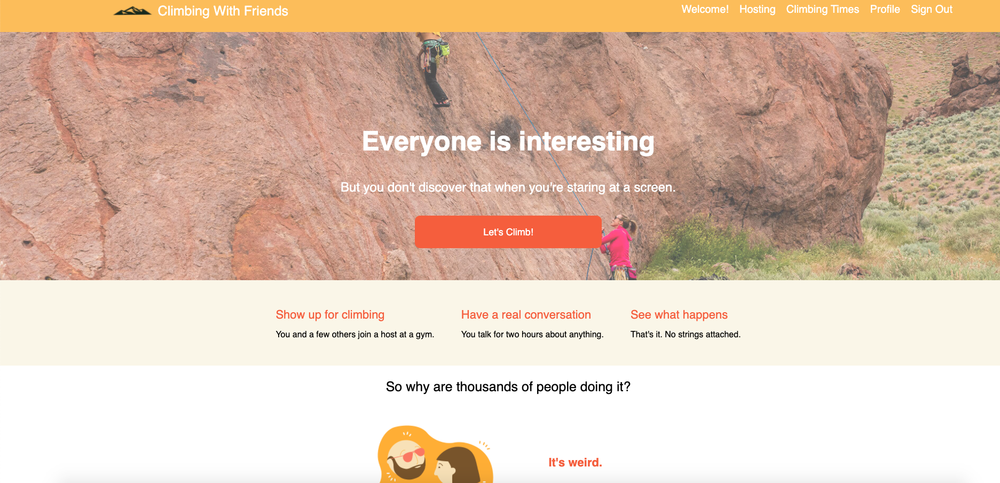
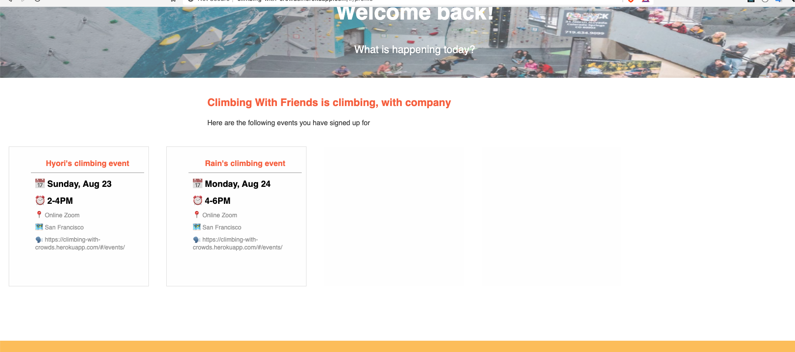

# Climbing with crowds

Welcome! Climbing with crowds is a site created in the vision of Tea with Strangers. It's purpose is to act as meeting platform for users to join and create rock climbing sessions with each other! \
https://climbing-with-crowds.herokuapp.com/

## Technologies implemented
Climbing with Crowds was built using:
* JavaScript 8
* React 16.8
* Redux 4.0.1
* Ruby on Rails 5.2.4
* PostgreSQL 2.2.2
* webpack 4.32.2

## Background and Overview
Climbing with Friends is a listing app aimed at allowing users to create and join rock climbing events with other users on the website.

[Live Link](https://climbing-with-crowds.herokuapp.com/)


## Features
### Authorization
Climbing with Crowds has backend authentization and persistent user state. As a user logs in, a cookie is used to keep track of their login in case they leave the website. An email address is saved to the backend and model level auth is used to ensure an email and password is unique.
```JavaScript
 def create
    @user = User.find_by_credentials(
      params[:user][:name],
      params[:user][:password]
    )

    if @user
      login(@user)
      render "api/users/show"
    else
      
      render json: ["Invalid name/password combination"], status: 401
    end
  end 

```
### Event listings
Users are able to view an index page that shows a list of cities and all the events that scheduled to happen.  


```JavaScript
export const requestEvent = id => dispatch => (
    APIUtil.fetchEvent(id).then(
        event => (
            dispatch(receiveEvent(event))
        )
    )
)
```
- User can view specific event information and logged in users are able to join any existing event.


### Event joining
User may signup for an event by clicking the sign me up button. Once a user has signed up for an event, it will appear in their dash board.



## Features planned

- Google maps api for users to better understand the meetup location.

