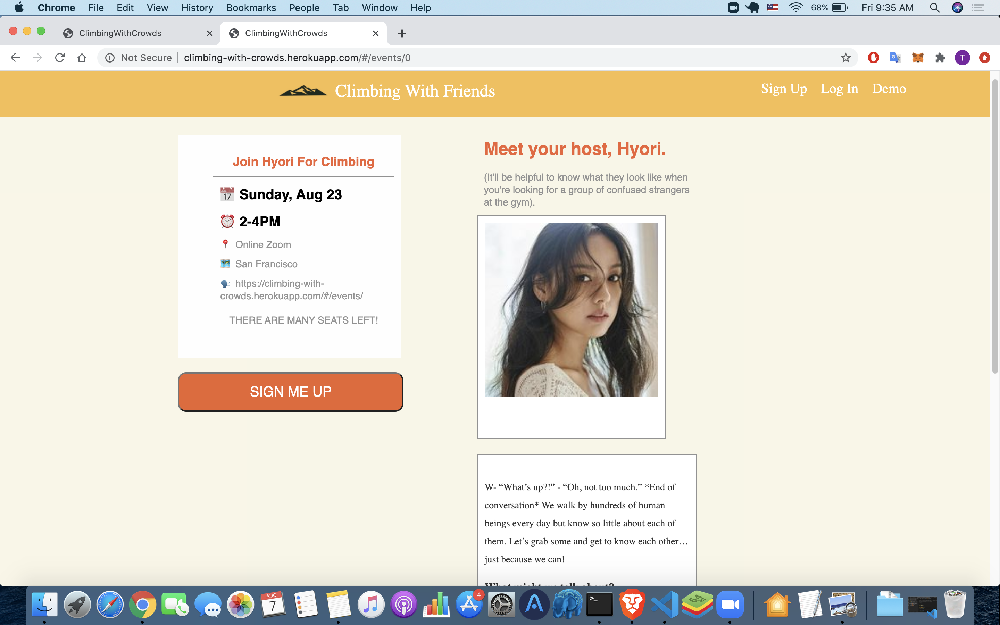

# Climbing with crowds

Welcome! Climbing with crowds is a site created in the vision of Tea with Strangers. It's purpose is to act as meeting platform for users to join and create rock climbing sessions with each other! \
https://climbing-with-crowds.herokuapp.com/

## Technologies implemented
The site was built from scratch, utilizing Ruby on Rails and PostgreSQL for the backend and Javascript with React/Redux on the frontend.

## Features
- Users are able to login/signup or use a demo login to complete encrypted user authentication.
``` def create
    @user = User.find_by_credentials(
      params[:user][:name],
      params[:user][:password]
    )

    if @user
      login(@user)
      render "api/users/show"
    else
      
      render json: ["Invalid name/password combination"], status: 401
    end
  end 

```
- Users are able to view an index page that shows a list of cities and all the events that scheduled to happen.

```
export const requestEvent = id => dispatch => (
    APIUtil.fetchEvent(id).then(
        event => (
            dispatch(receiveEvent(event))
        )
    )
)
```
- User can view specific event information and logged in users are able to join any existing event.


- User can host an event by creating an event with relevant event details.

## Features planned
- User dashboard for users to view their past and upcoming events.
- Google maps api for users to better understand the meetup location.

